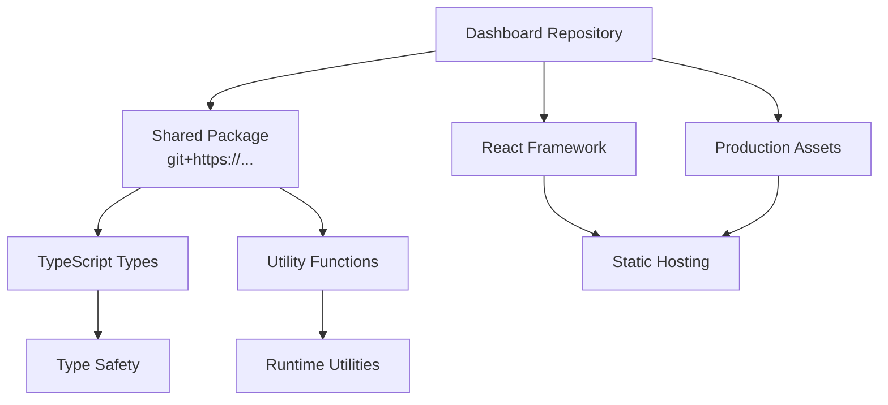

# 🎨 BankIM Admin Dashboard - Frontend Deployment Repository

**Production-ready React application for the BankIM Management Portal frontend**

---

## 🎯 Repository Overview

**Repository**: `bankim-admin-dashboard`  
**URL**: `git@github.com:sravnenie-ipotek/bankim-admin-dashboard.git`  
**Type**: Frontend Deployment Repository  
**Purpose**: Standalone React application optimized for production deployment  
**Role**: Frontend hosting target - receives filtered content from development workspace  

---

## 🏗️ Architecture Position

This repository serves as the **frontend deployment target** in our 4-repository hybrid architecture:

```
DEVELOPMENT LAYER
┌─────────────────────────────────────────────────────────┐
│  🏠 bankim-admin-workspace (Development Monorepo)      │
│  Contains: packages/client + packages/server + docs    │
└─────────────────────┬───────────────────────────────────┘
                      │ Automated Deployment
                      ▼
DEPLOYMENT LAYER
┌─────────────────────────────────────────────────────────┐
│  🎨 bankim-admin-dashboard (THIS REPOSITORY)           │
│  Contains: React app + production config + assets      │
│  Purpose: Frontend deployment to hosting platforms     │
└─────────────────────┬───────────────────────────────────┘
                      │ Deploy to Production
                      ▼
HOSTING LAYER  
┌─────────────────────────────────────────────────────────┐
│  🌐 Production Hosting (Vercel/Netlify/CDN)           │
│  Serves: Static React build + optimized assets         │
└─────────────────────────────────────────────────────────┘
```

### Connection Strategy
- **Source**: Receives filtered content from `packages/client/` in workspace
- **Dependencies**: Links to `bankim-admin-shared` via git reference
- **Deployment**: Optimized for static hosting platforms
- **Updates**: Automated via `npm run push:dashboard` from workspace

---

## 📦 Repository Contents

This repository contains **only** the frontend application with production optimizations:

```
bankim-admin-dashboard/
├── 📁 src/                         # React application source
│   ├── components/                 # Reusable UI components
│   │   ├── AdminLayout/            # Main layout wrapper
│   │   ├── SharedMenu/             # Navigation menu
│   │   ├── ContentEditModals/      # Content editing modals
│   │   ├── ProtectedRoute/         # Authentication wrapper
│   │   └── */                      # Additional components
│   │
│   ├── pages/                      # Page components & routing
│   │   ├── ContentMain/            # Main content management
│   │   ├── ContentMortgage/        # Mortgage content pages
│   │   ├── ContentCredit/          # Credit content pages
│   │   ├── SharedContentEdit/      # Shared editing components
│   │   └── */                      # Additional page components
│   │
│   ├── services/                   # API integration layer
│   │   └── api.ts                  # Centralized API service
│   │
│   ├── contexts/                   # React Context providers
│   │   ├── AuthContext.tsx         # Authentication state
│   │   ├── LanguageContext.tsx     # Multilingual support  
│   │   └── NavigationContext.tsx   # Navigation state
│   │
│   ├── hooks/                      # Custom React hooks
│   ├── utils/                      # Helper utilities
│   ├── assets/                     # Static assets & images
│   ├── locales/                    # Translation files (JSON)
│   └── shared/                     # Shared components
│
├── 📁 public/                      # Static public assets
│   ├── assets/images/              # Application images
│   └── index.html                  # HTML template
│
├── 📁 cypress/                     # End-to-end testing
│   ├── e2e/                        # Test specifications
│   ├── support/                    # Test utilities
│   └── cypress.config.ts           # Cypress configuration
│
├── 📁 dist/                        # Production build output
│   ├── assets/                     # Optimized assets
│   ├── index.html                  # Built HTML
│   └── *.js, *.css                 # Compiled application
│
├── ⚙️ Configuration Files
│   ├── package.json                # Production dependencies
│   ├── vite.config.ts              # Build configuration
│   ├── tsconfig.json               # TypeScript settings
│   ├── .eslintrc.js                # Code quality rules
│   └── index.html                  # Entry HTML template
│
└── 📄 README.md                    # This documentation
```

---

## 🔗 Dependency Strategy

### Production Dependencies
```json
{
  "name": "@bankim/client",
  "dependencies": {
    "@bankim/shared": "git+https://github.com/sravnenie-ipotek/bankim-admin-shared.git",
    "react": "^18.2.0",
    "react-dom": "^18.2.0", 
    "react-router-dom": "^6.8.1"
  }
}
```

### Key Dependency Design
- **Shared Package**: Git-based reference to shared types repository
- **Framework**: React 18 with modern hooks and concurrent features
- **Routing**: React Router v6 with data loading capabilities
- **Build**: Vite for fast development and optimized production builds
- **Testing**: Cypress for comprehensive E2E testing

### Dependency Resolution Flow


---

## 🚀 Deployment Workflow

### Automated Deployment from Workspace
This repository **should not be directly modified**. All changes come from the workspace:

```bash
# From bankim-admin-workspace repository:
npm run push:dashboard              # Deploy frontend changes only
npm run push:all                    # Deploy all repositories including dashboard
```

### What Happens During Deployment
1. **Content Filtering**: Extracts `packages/client/` from workspace
2. **Dependency Transformation**: Changes shared reference from `file:../shared` to git URL
3. **Configuration Swap**: Uses `package.deploy.json` for production dependencies  
4. **Git Operations**: Commits and pushes filtered content to this repository
5. **Restoration**: Restores original development configuration in workspace

### Production Build Process
```bash
# These commands run automatically in hosting environment:
npm install                         # Install production dependencies
npm run build                       # Build optimized React app
npm run preview                     # Optional: preview production build
```

---

## 🌐 Hosting Strategy

### Recommended Hosting Platforms
This repository is optimized for **static hosting** platforms:

#### **🔥 Vercel (Recommended)**
```yaml
Framework: Vite
Build Command: npm run build
Output Directory: dist
Node.js Version: 18.x
Environment Variables:
  VITE_API_URL: https://your-api-domain.railway.app
  VITE_USE_REAL_CONTENT_DATA: "true"
```

#### **🚀 Netlify**
```yaml
Build Command: npm run build
Publish Directory: dist
Node.js Version: 18
Environment Variables:
  VITE_API_URL: https://your-api-domain.railway.app
  VITE_CONTENT_CACHE_TTL: "300000"
```

#### **☁️ AWS S3 + CloudFront**
```yaml
Build Process: npm run build
Upload Target: dist/ folder
CloudFront: Enable for CDN
Route 53: Optional custom domain
```

#### **🔧 Other Static Hosts**
- **GitHub Pages**: Requires workflow configuration
- **Surge.sh**: Simple deployment with custom domains  
- **Firebase Hosting**: Google Cloud integration

### Environment Configuration
```env
# Production environment variables (configure in hosting platform)
VITE_API_URL=https://your-api-domain.railway.app
VITE_USE_REAL_CONTENT_DATA=true
VITE_CONTENT_CACHE_TTL=300000
VITE_ENVIRONMENT=production
```

---

## 🎯 Technical Architecture

### Frontend Technology Stack
```yaml
Core Framework: React 18.2.0
Language: TypeScript (strict mode)
Build Tool: Vite 5.0.8
Routing: React Router DOM 6.8.1
Styling: CSS Modules + CSS Custom Properties
State Management: React Context + Local State
Testing: Cypress 14.5.3 (E2E)
```

### Application Architecture Patterns

#### **Component Architecture**
- **Pages**: Route-level components in `src/pages/`
- **Components**: Reusable UI components in `src/components/`  
- **Shared**: Cross-cutting components in `src/shared/`
- **Styling**: Co-located CSS files (e.g., `Component.tsx` + `Component.css`)

#### **State Management Strategy**
- **Global State**: React Context for auth, language, navigation
- **Local State**: Component state with `useState` and `useReducer`
- **Server State**: API service with caching and error handling
- **Form State**: Controlled components with validation

#### **Routing Strategy**
```typescript
// Route structure
/                           # Dashboard home
/content/*                  # Content management pages
/content/mortgage          # Mortgage content
/content/credit            # Credit content  
/qa/*                      # Quality assurance pages
/admin/*                   # Administrative pages
```

#### **API Integration Pattern**
```typescript
// Centralized API service
import { apiService } from './services/api';

// Usage in components
const { data, loading, error } = useFetch(() => 
  apiService.getContentByScreen('mortgage_step1', 'ru')
);
```

---

## 🔧 Development & Testing

### Local Development (Not Recommended)
While possible, local development should happen in the workspace repository:

```bash
# If you must develop locally (not recommended):
git clone git@github.com:sravnenie-ipotek/bankim-admin-dashboard.git
cd bankim-admin-dashboard
npm install
npm run dev
```

### Testing Strategy
```bash
# E2E testing with Cypress
npm run cypress:open                # Interactive testing
npm run cypress:run                 # Headless testing
npm run test:mortgage              # Specific test suites
npm run test:content-errors        # Content validation tests
npm run test:all                   # Complete test suite
```

### Quality Assurance
```bash
# Code quality checks
npm run lint                       # ESLint code quality
npm run type-check                 # TypeScript validation
npm run build                      # Production build test
```

---

## 🚨 Critical Usage Guidelines

### ✅ **Correct Usage**

#### **For Hosting Platforms**
- **Clone this repository** for production deployment
- **Configure environment variables** in hosting platform
- **Set build commands** as documented above
- **Monitor deployment status** through hosting dashboard

#### **For DevOps/CI/CD**
- **Use this repository** as deployment source
- **Configure automated builds** on commits to `main` branch
- **Set up monitoring** for build failures and performance
- **Implement rollback procedures** using git history

#### **For QA/Testing**
- **Run E2E tests** against deployed version
- **Validate functionality** using Cypress test suites
- **Check performance** using Lighthouse or similar tools
- **Test across browsers** using Cypress cross-browser features

### ❌ **Incorrect Usage**

#### **Don't Develop Here**
- **❌ Don't make direct changes** to this repository
- **❌ Don't add features** or fix bugs here
- **❌ Don't modify package.json** or configuration files
- **❌ Don't commit development artifacts** like IDE files

#### **Don't Manual Sync**
- **❌ Don't manually copy files** from workspace
- **❌ Don't cherry-pick commits** from other repositories
- **❌ Don't resolve merge conflicts** manually
- **❌ Don't force push** without understanding implications

### 🔄 **If You Need Changes**
1. **Make changes in workspace**: `bankim-admin-workspace`
2. **Test thoroughly**: `npm run build && npm run test`
3. **Deploy from workspace**: `npm run push:dashboard`
4. **Verify deployment**: Check this repository for updates
5. **Test production**: Validate on hosting platform

---

## 🔍 Monitoring & Maintenance

### Repository Health
```bash
# Check deployment status
git log --oneline -10              # Recent deployments
git status                         # Working directory status
git remote -v                      # Remote configuration

# Dependency health
npm audit                          # Security vulnerability scan
npm outdated                       # Dependency update status
npm ls                             # Dependency tree
```

### Performance Monitoring
- **Build Size**: Monitor dist/ folder size after builds
- **Bundle Analysis**: Use Vite bundle analyzer for optimization
- **Lighthouse Scores**: Regular performance audits
- **Core Web Vitals**: Monitor loading performance metrics

### Security Considerations
- **Dependency Updates**: Regular security patches
- **Environment Variables**: Secure API keys and endpoints
- **HTTPS**: Enforce secure connections in production
- **CSP Headers**: Configure Content Security Policy

---

## 📊 Repository Metrics

```yaml
Repository Type: Frontend Deployment (Production)
Primary Purpose: React application hosting
Source Repository: bankim-admin-workspace
Update Frequency: On-demand via deployment scripts

Technical Specifications:
  Framework: React 18 + TypeScript
  Build Tool: Vite (ES modules, optimized builds)
  Bundle Size: ~500KB initial, ~2MB total (estimated)
  Browser Support: Modern browsers (ES2020+)
  Performance: <3s load time on 3G (target)

Deployment Specifications:  
  Hosting: Static hosting platforms
  Environment: Production
  Dependencies: Git-based (@bankim/shared)
  Build Output: Optimized SPA with code splitting
  CDN: Recommended for global performance
```

---

## 🔗 Related Repositories

| Repository | Relationship | Purpose |
|------------|-------------|---------|
| **bankim-admin-workspace** | 📤 Source | Development environment and deployment trigger |
| **bankim-admin-api** | 🔗 API Backend | Provides data via REST API (separate deployment) |
| **bankim-admin-shared** | 📦 Dependency | Shared TypeScript types and utilities |

### Integration Points
- **API Communication**: Connects to backend via `VITE_API_URL` environment variable
- **Shared Types**: Uses git-based dependency for TypeScript interfaces
- **Development Sync**: Automatically updated from workspace repository
- **Testing Integration**: Can run E2E tests against any API endpoint

---

## 📞 Quick Reference

### Essential Information
```yaml
Repository URL: git@github.com:sravnenie-ipotek/bankim-admin-dashboard.git
Primary Purpose: Frontend production deployment
Update Method: Automated from bankim-admin-workspace
Development Location: bankim-admin-workspace/packages/client/
Hosting Type: Static hosting (Vercel/Netlify recommended)
```

### Emergency Procedures
```bash
# Rollback to previous version
git reset --hard HEAD~1
git push --force-with-lease origin main

# Re-deploy from workspace (if this repo gets corrupted)
# From bankim-admin-workspace:
npm run push:dashboard --force

# Check deployment integrity
npm run build                      # Should complete successfully
npm run type-check                 # Should pass without errors
```

---

**🎯 Bottom Line**: This repository contains the production-ready React application for the BankIM Management Portal frontend. It's automatically maintained from the workspace repository and optimized for static hosting platforms. Don't develop here - use the workspace. For hosting platforms, configure build commands as documented and set the required environment variables.

---

_**Architecture**: Frontend Deployment Repository in 4-Repository Strategy_  
_**Role**: Production React application hosting target_  
_**Status**: Production-ready with automated deployment pipeline_