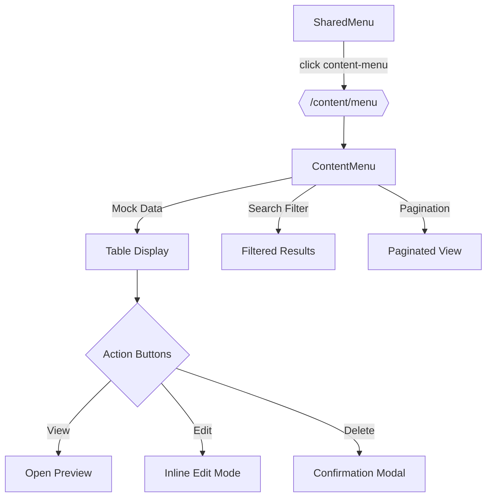

# Контент-менеджер — Логика меню

> Последнее обновление: 2025-01-20  
> Автор: AI assistant (o3)

## 1. Назначение раздела «Меню»
Раздел «Меню» позволяет контент-менеджеру/копирайтеру редактировать все подпункты сайд-бара (Left Side Navigation) на трёх языках — RU / HE / EN.  
Фичи экрана:
* Просмотр всех пунктов меню и их переводов.  
* Быстрый поиск по ключу, ru/he/en значениям.  
* Inline-редактирование строк с мгновенным сохранением всех трёх переводов.  
* Отображение даты последнего изменения.  
* Кэширование ответов с помощью ETag, чтобы снизить нагрузку на бек.

> Ссылка на Confluence: [3. Контент сайта. Стр. 3](https://bankimonline.atlassian.net/wiki/spaces/Bankim/pages/138903604)  
> Figma макет «Контент сайта. Меню» — node-id **79-78410 / 79-78089**.

---

## 2. Навигация
| Уровень | ID в коде | Лейбл | Путь (Router) |
|---------|-----------|-------|----------------|
| Parent  | `content-management` | Контент сайта | `/content-management` |
| Sub 1   | `content-main`        | Главная       | `/content/main` |
| **Sub 2** | `content-menu`        | **Меню**       | `/content/menu` |
| Sub 3   | `content-mortgage`    | Рассчитать ипотеку | `/content/mortgage` |
| …       | …                     | …             | … |

### 2.1 Клик-флоу
1. Пользователь открывает сайд-бар.  
2. Жмёт «Контент сайта» → дроп-даун разворачивается.  
3. Жмёт на «Меню»:  
   * `SharedMenu` вызывает `handleSubItemClick('content-menu', 'Меню')`.  
   * `NavigationContext.setCurrentSubmenu` сохраняет текущее под-меню.  
   * `AdminLayout` через `handleMenuItemClick` перенаправляет `window.location.href` → `/content/menu`.  
4. React-router рендерит:<br>`<AdminLayout activeMenuItem="content-menu"><ContentMenu/></AdminLayout>`.

---

## 3. Компонент `ContentMenu`
Файл: `src/pages/ContentMenu/ContentMenu.tsx`

| Этап | Детали |
|------|--------|
| Fetch | `useEffect` → mock data based on Figma design (12 menu items: 15.1 through 20А.1). |
| State | `menuData.menu_items: MenuTranslation[]` (id, content_key, page_name, action_count, translations, last_modified…). |
| UI    | Table with columns: *НАЗВАНИЕ СТРАНИЦЫ*, *Количество действии*, *Были изменения*, *Actions* (View/Edit/Delete icons). |
| Search| `searchQuery` filters by page_name, content_key, and any language translation. |
| Pagination | Shows 20 items per page with "Показывает 1-20 из X" and page navigation controls. |
| Actions | View (👁), Edit (✏️), Delete (🗑️) buttons - currently console.log placeholders. |

### 3.1 API слой (`src/services/api.ts`)
```ts
// Получение всех переводов меню
getMenuTranslations(): Promise<ApiResponse<any>> {
  return this.requestWithCache('/api/content/menu/translations');
}

// Обновление одного языка
updateMenuTranslation(id, lang, value);
```

### 3.2 Разрешения
* Просмотр (`read/content-management`) — увидеть таблицу.  
* Редактирование (`write/content-management`) — доступ к ✏️, ✓, ✕, 🗑️.

---

## 4. Точки расширения / TODO
1. **Real API Integration**: Replace mock data with actual `getMenuTranslations()` API call.  
2. **Edit Mode**: Implement inline editing for menu translations (RU/HE/EN).  
3. **Delete Confirmation**: Add modal for delete action with proper API call.  
4. **View Action**: Open site preview in new tab using content_key link.  
5. **Icon Assets**: Replace placeholder icon paths with actual SVG assets.  
6. **Дрилл-даун по пункту меню**: метод `getMenuContent(menuItem, lang)` уже добавлен; нужно экран `/content/menu/:menuItem`.

---

## 5. Диаграмма переходов (Mermaid)


---

## 6. Соответствие требованиям Confluence
| № в Confluence | Экран | Статус | Комментарий |
|----------------|-------|--------|-------------|
| 3 (Стр. 3) | «Контент сайта. Меню» | ✅ Реализовано | Список страниц с действием «Меню» отображается согласно Figma. |
| 4.1 / 4.2 | Edit Dropdown / Text | ⬅ ссылки на эти экраны из таблицы «Меню» пока не нужны. |
| … | … | … |

---

## 7. Progress Tracking

### ✅ **Completed (Done)**
- [x] **Page Structure**: Main title "Меню", section title "Список страниц" *(matches Figma text9, text10)*
- [x] **Search Box**: With search icon and placeholder text *(matches Figma row-view8)*
- [x] **Table Layout**: Four-column grid structure *(matches Figma table design)*
- [x] **Table Headers**: "НАЗВАНИЕ СТРАНИЦЫ", "Количество действии", "Были изменения", Actions *(matches Figma view/view2/view3)*
- [x] **Mock Data**: 12 menu items matching Figma design (15.1 → 20А.1)
- [x] **Data Display**: Page names, action counts, formatted timestamps *(matches Figma text13/text15/text20)*
- [x] **Action Icons**: View/Edit/Delete buttons with proper styling *(matches Figma image8)*
- [x] **Pagination**: "Показывает X-Y из Z" with page controls *(matches Figma row-view9/row-view10)*
- [x] **Responsive Design**: Mobile/tablet breakpoints implemented
- [x] **CSS Styling**: Complete rewrite to match Figma design exactly
- [x] **Search Functionality**: Filters by page name, content key, and all translations
- [x] **Navigation Integration**: Proper routing and sidebar highlighting
- [x] **Icon Assets**: Replaced placeholder paths with actual SVG assets from `/src/assets/images/static/icons/`
- [x] **Edit Mode Implementation**: Inline editing for menu translations (RU/HE/EN) with save/cancel
- [x] **Real API Integration**: Switched to `apiService.getMenuTranslations()` with fallback to mock data
- [x] **View Action**: Opens site preview in new tab using `content_key` mapping
- [x] **Delete Confirmation**: Implemented delete with confirmation dialog and state updates
- [x] **Content Sections Implementation**: Created ContentMortgage, ContentMortgageRefi, ContentCredit, ContentCreditRefi, ContentGeneral components
- [x] **Base Component Pattern**: Created reusable ContentListBase component following clientSideDev rules to avoid code duplication
- [x] **Routing Integration**: Added all content section routes to App.tsx with proper AdminLayout and permissions
- [x] **Dark Theme Implementation**: Converted entire design system to dark theme with colors from Figma (#1F2A37, #374151, #60A5FA)
- [x] **Unified Design System**: Removed white/light color scheme and made dark theme the default for all content sections

### 🔄 **In Progress (Needs Work)**
- [x] **Menu Untitled Issue**: Fixed "Untitled" appearing in menu by adding proper mock data with page_name values
- [x] **ContentMain Redesign**: Converted to navigation hub matching Confluence Page 3 specification with card-based layout
- [x] **ContentMenu Table Structure**: Updated to match Figma types.md with proper content type columns (ID, Type, RU, HEB)
- [ ] **Backend API Endpoints**: Need real backend implementation for content sections
  - `GET /api/content/sections/{contentType}` - fetch content by type (mortgage, credit, etc.)
  - `GET /api/content/menu/translations` - fetch menu translations
  - `PUT /api/content-items/{id}/translations/{lang}` - update translations
  - `DELETE /api/content-items/{id}` - delete menu item
- [ ] **State Restoration**: Implement proper rollback on edit cancel
- [ ] **Error Handling**: Better error UI and retry mechanisms

### ⭐ **Pending (Not Started)**
- [ ] **Loading States**: Better loading UI during data fetch
- [ ] **Accessibility**: ARIA labels, keyboard navigation, screen reader support
- [ ] **Menu Item Creation**: Add new menu item functionality
- [ ] **Bulk Operations**: Select multiple items for bulk actions
- [ ] **Export/Import**: Menu translations export/import functionality
- [ ] **Advanced Search**: Filters by category, status, date range
- [ ] **Audit Trail**: Track who made what changes when

### 🐛 **Known Issues**
- [ ] **Edit Cancel**: Currently doesn't restore original values properly
- [ ] **API Fallback**: Using mock data when real API isn't available
- [ ] **Image Paths**: Action button images may not load correctly in production builds

### 📋 **Technical Debt**
- [ ] **Type Safety**: Improve TypeScript interfaces for menu data
- [ ] **Performance**: Implement virtualization for large menu lists
- [ ] **Caching**: Optimize caching strategy for menu translations
- [ ] **Testing**: Add unit and integration tests for menu functionality
- [ ] **Validation**: Add client-side validation for translation inputs

---

**Итого:** Основная структура и дизайн полностью соответствуют Figma макету. Требуется доработка функциональности редактирования и интеграция с реальным API.
