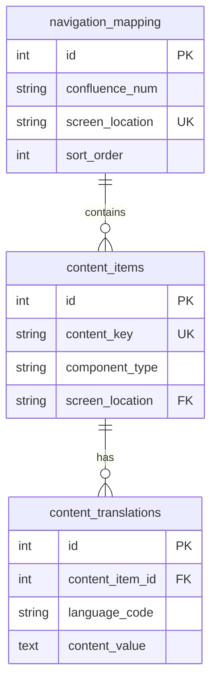

# BankIM Content Management System - Complete Architecture & Logic Documentation

## Executive Summary

The BankIM Management Portal implements a sophisticated multi-language content management system (CMS) that allows real-time editing of UI content across the entire banking platform. This document provides a comprehensive explanation of the content editing logic, database architecture, and code implementation.

## Table of Contents

1. [System Overview](#system-overview)
2. [Database Architecture](#database-architecture)
3. [Navigation Flow](#navigation-flow)
4. [API Endpoints](#api-endpoints)
5. [Frontend Implementation](#frontend-implementation)
6. [Authentication & Session Management](#authentication--session-management)
7. [Error Handling & Recovery](#error-handling--recovery)
8. [Practical Examples](#practical-examples)

## System Overview

### Core Capabilities
- **Multi-language Support**: Russian (primary), Hebrew (RTL), English
- **Real-time Editing**: Instant content updates without deployment
- **Confluence Integration**: Content structure mapped from Confluence documentation
- **Role-based Access**: Content management restricted by permissions
- **Database-driven**: All UI text stored in PostgreSQL

### Tech Stack
- **Frontend**: React 18 + TypeScript + Vite
- **Backend**: Express.js + PostgreSQL
- **Monorepo**: Turborepo for orchestration
- **Database**: PostgreSQL with normalized schema

## Database Architecture

### Core Tables

#### 1. `content_items` Table
Stores metadata about each content piece.

```sql
CREATE TABLE content_items (
  id SERIAL PRIMARY KEY,
  content_key VARCHAR(255) UNIQUE NOT NULL,  -- Unique identifier like 'phone_modal.title'
  component_type VARCHAR(50),                -- text, button, dropdown, link, placeholder
  category VARCHAR(50),                      -- modal, form, navigation, legal
  screen_location VARCHAR(255),              -- Maps to navigation_mapping.screen_location
  description TEXT,                          -- Developer notes
  is_active BOOLEAN DEFAULT true,
  page_number INTEGER,                       -- Confluence page reference
  created_at TIMESTAMP,
  updated_at TIMESTAMP
);
```

#### 2. `content_translations` Table
Stores actual text in all languages.

```sql
CREATE TABLE content_translations (
  id SERIAL PRIMARY KEY,
  content_item_id INTEGER REFERENCES content_items(id),
  language_code VARCHAR(5),       -- 'ru', 'he', 'en'
  content_value TEXT,             -- The actual text content
  created_at TIMESTAMP,
  updated_at TIMESTAMP,
  UNIQUE(content_item_id, language_code)
);
```

#### 3. `navigation_mapping` Table
Maps Confluence documentation structure to database.

```sql
CREATE TABLE navigation_mapping (
  id SERIAL PRIMARY KEY,
  confluence_num VARCHAR(10),        -- e.g., '2', '3.1', '4.5'
  confluence_title_ru TEXT,          -- Russian title from Confluence
  confluence_title_he TEXT,          -- Hebrew title
  confluence_title_en TEXT,          -- English title
  screen_location VARCHAR(255) UNIQUE, -- Unique identifier for routing
  parent_section VARCHAR(10),        -- Parent section number
  sort_order INTEGER,                -- Display order
  is_drill BOOLEAN DEFAULT false,    -- Is this a drill-down page?
  created_at TIMESTAMP
);
```

### Relationships



## Navigation Flow

### Three-Tier Navigation System

#### Tier 1: List View
**Route**: `/content/mortgage`
**Component**: `ContentMortgage.tsx`

```typescript
// Fetches all mortgage screens with content counts
const response = await fetch('/api/content/mortgage');
const data = response.data;

// Data structure returned:
[
  {
    confluence_num: "2",           // Confluence document number
    title_ru: "0;L:C;OB>@ 8?>B5:8",
    screen_location: "mortgage_calculator",
    content_count: 45,
    last_updated: "2025-08-19"
  },
  // ... more screens
]
```

#### Tier 2: Drill View
**Route**: `/content/mortgage/drill/:screenLocation`
**Component**: `SharedContentScreen.tsx`

```typescript
// Fetches all content items for a specific screen
const response = await fetch(`/api/content-items?screen_location=${screenLocation}`);

// Data structure returned:
[
  {
    id: 1465,
    content_key: "phone_modal.title",
    component_type: "text",
    translations: {
      ru: "2548B5 =><5@ B5;5D>=0",
      he: "ÔÖß Þáäè ØÜäÕß",
      en: "Enter phone number"
    }
  },
  // ... more items
]
```

#### Tier 3: Edit Modal
**Components**: `TextEditModal`, `DropdownEditModal`, `LinkEditModal`

```typescript
// Update translation for specific language
await fetch(`/api/content-items/${contentItemId}/translations/${languageCode}`, {
  method: 'PUT',
  body: JSON.stringify({ content_value: newText })
});
```

### Navigation Example Flow

1. User clicks " 0AAG8B0BL 8?>B5:C" in menu
2. System navigates to `/content/mortgage` using React Router
3. List shows all mortgage screens with Confluence numbers
4. User clicks "3. 2>4 =><5@0 B5;5D>=0"
5. System navigates to `/content/mortgage/drill/mortgage_phone`
6. Drill view shows all content items for phone verification
7. User clicks edit on "phone_modal.title"
8. Modal opens with all three language versions
9. User edits and saves
10. System updates database and refreshes view

## API Endpoints

### 1. Get Content by Section
```javascript
GET /api/content/:section
// Example: /api/content/mortgage

// Response:
{
  success: true,
  data: [
    {
      confluence_num: "2",
      title_ru: "0;L:C;OB>@ 8?>B5:8",
      title_he: "Þ×éÑÕß ÞéÛàêÐ",
      title_en: "Mortgage Calculator",
      screen_location: "mortgage_calculator",
      content_count: 45,
      last_updated: "2025-08-19T10:30:00Z"
    }
  ]
}
```

### 2. Get Content Items
```javascript
GET /api/content-items?screen_location=mortgage_phone

// Response:
{
  data: [
    {
      id: 1465,
      content_key: "phone_modal.title",
      component_type: "text",
      category: "modal",
      screen_location: "mortgage_phone",
      translations: {
        ru: "2548B5 =><5@ B5;5D>=0",
        he: "ÔÖß Þáäè ØÜäÕß",
        en: "Enter phone number"
      }
    }
  ]
}
```

### 3. Update Translation (Critical Endpoint)
```javascript
PUT /api/content-items/:contentItemId/translations/:languageCode

// Request body:
{
  content_value: "Updated text content"
}

// Implementation in server.js (lines 1711-1776):
app.put('/api/content-items/:contentItemId/translations/:languageCode', async (req, res) => {
  const { contentItemId, languageCode } = req.params;
  const { content_value } = req.body;
  
  try {
    // Check if translation exists
    const checkQuery = `
      SELECT * FROM content_translations 
      WHERE content_item_id = $1 AND language_code = $2
    `;
    const existing = await pool.query(checkQuery, [contentItemId, languageCode]);
    
    if (existing.rows.length > 0) {
      // Update existing
      const updateQuery = `
        UPDATE content_translations 
        SET content_value = $1, updated_at = CURRENT_TIMESTAMP
        WHERE content_item_id = $2 AND language_code = $3
        RETURNING *
      `;
      const result = await pool.query(updateQuery, [content_value, contentItemId, languageCode]);
      res.json({ success: true, data: result.rows[0] });
    } else {
      // Insert new
      const insertQuery = `
        INSERT INTO content_translations (content_item_id, language_code, content_value)
        VALUES ($1, $2, $3)
        RETURNING *
      `;
      const result = await pool.query(insertQuery, [contentItemId, languageCode, content_value]);
      res.json({ success: true, data: result.rows[0] });
    }
  } catch (error) {
    res.status(500).json({ error: error.message });
  }
});
```

## Frontend Implementation

### Key Components

#### 1. AdminLayout.tsx
```typescript
// CRITICAL FIX: Use React Router navigation, not window.location
import { useNavigate } from 'react-router-dom';

const navigate = useNavigate();

const handleMortgageClick = () => {
  // L WRONG - causes full page reload and session loss
  // window.location.href = '/content/mortgage';
  
  //  CORRECT - client-side navigation preserves session
  navigate('/content/mortgage');
};
```

#### 2. API Service (api.ts)
```typescript
// CRITICAL: Always include credentials for session persistence
const apiRequest = async (url: string, options: RequestInit = {}) => {
  const response = await fetch(url, {
    ...options,
    credentials: 'include',  // Essential for session cookies
    headers: {
      'Content-Type': 'application/json',
      ...options.headers,
    }
  });
  
  if (!response.ok) {
    throw new Error(`API Error: ${response.status}`);
  }
  
  return response.json();
};
```

#### 3. Content Mapping
```typescript
// CRITICAL: Preserve confluence_num through data pipeline
const mapContentItem = (item: any) => ({
  id: item.id,
  content_key: item.content_key,
  confluence_num: item.confluence_num,  // Must preserve this!
  screen_location: item.screen_location,
  translations: {
    ru: item.title_ru || item.content_value_ru,
    he: item.title_he || item.content_value_he,
    en: item.title_en || item.content_value_en
  }
});
```

## Authentication & Session Management

### Problem & Solution
**Problem**: Full page reloads (`window.location.href`) lose session cookies, causing authentication failures.

**Solution**: Use React Router for all navigation.

```typescript
// App.tsx - Protected routes
<Route path="/content/*" element={
  <ProtectedRoute requiredPermission={{ action: 'read', resource: 'content-management' }}>
    <Outlet />
  </ProtectedRoute>
}>
  <Route path="mortgage" element={<ContentMortgage />} />
  <Route path="mortgage/drill/:screenLocation" element={<SharedContentScreen />} />
</Route>
```

## Error Handling & Recovery

### Common Issues & Solutions

#### 1. Missing Translation Endpoint (404)
**Error**: `PUT /api/content-items/1465/translations/ru 404 (Not Found)`
**Solution**: Added endpoint in server.js lines 1711-1776

#### 2. Wrong Database Column
**Error**: `column 'title_he' of relation 'content_translations' does not exist`
**Solution**: Use `content_value` with `language_code`, not language-specific columns

#### 3. Missing Confluence Numbers
**Issue**: Shows 1-12 instead of 2-14
**Solution**: Preserve `confluence_num` field through entire data pipeline

#### 4. Empty Content Screens
**Issue**: Screen shows 0 content items
**Solution**: Run SQL population script (see Practical Examples)

## Practical Examples

### Example 1: Adding Phone Verification Content
```sql
-- File: add-phone-verification-content-fixed.sql
-- Add content items for phone verification modal (screen 3)

INSERT INTO content_items (content_key, component_type, category, screen_location)
VALUES 
  ('phone_modal.title', 'text', 'modal', 'mortgage_phone'),
  ('phone_modal.subtitle', 'text', 'modal', 'mortgage_phone'),
  ('phone_modal.input.name', 'placeholder', 'form', 'mortgage_phone'),
  ('phone_modal.button.continue', 'button', 'action', 'mortgage_phone');

-- Add translations
INSERT INTO content_translations (content_item_id, language_code, content_value)
SELECT 
  ci.id,
  'ru',
  CASE ci.content_key
    WHEN 'phone_modal.title' THEN '2548B5 20H =><5@ B5;5D>=0'
    WHEN 'phone_modal.subtitle' THEN ''B>1K ?>;CG8BL ?@54;>65=8O >B 10=:>2'
    WHEN 'phone_modal.input.name' THEN '>;=>5 8<O'
    WHEN 'phone_modal.button.continue' THEN '@>4>;68BL'
  END
FROM content_items ci
WHERE ci.screen_location = 'mortgage_phone';
```

### Example 2: Executing SQL Scripts
```javascript
// File: execute-phone-content-fixed.js
const { Pool } = require('pg');
const fs = require('fs');
const path = require('path');

const pool = new Pool({
  connectionString: process.env.CONTENT_DATABASE_URL
});

async function addContent() {
  const sql = fs.readFileSync(
    path.join(__dirname, 'database', 'add-phone-verification-content-fixed.sql'),
    'utf-8'
  );
  
  await pool.query(sql);
  console.log(' Content added successfully!');
}
```

### Example 3: Testing Content Updates
```bash
# 1. Verify database connection
npm run test:db --workspace=@bankim/server

# 2. Check content for specific screen
psql $CONTENT_DATABASE_URL -c "
  SELECT ci.content_key, ct.content_value
  FROM content_items ci
  JOIN content_translations ct ON ci.id = ct.content_item_id
  WHERE ci.screen_location = 'mortgage_phone'
  AND ct.language_code = 'ru'
  LIMIT 5;
"

# 3. Test via API
curl http://localhost:4000/api/content-items?screen_location=mortgage_phone

# 4. Update content via API
curl -X PUT http://localhost:4000/api/content-items/1465/translations/ru \
  -H "Content-Type: application/json" \
  -d '{"content_value": ">2K9 B5:AB"}'
```

## Critical Implementation Notes

### Must Remember
1. **NEVER use `window.location.href`** - Always use React Router `navigate()`
2. **ALWAYS include `credentials: 'include'`** in fetch requests
3. **PRESERVE `confluence_num`** through entire data flow
4. **USE `content_value` column** with `language_code`, not `title_he/title_ru`
5. **CHECK translation exists** before INSERT - use UPDATE if exists

### Database Column Structure
```sql
--  CORRECT - Normalized structure
content_translations:
  - content_item_id (FK)
  - language_code ('ru', 'he', 'en')
  - content_value (the actual text)

-- L WRONG - Old denormalized structure
content_translations:
  - title_ru
  - title_he
  - title_en
```

### Session Management
```typescript
//  CORRECT - Preserves session
const navigate = useNavigate();
navigate('/content/mortgage');

// L WRONG - Loses session
window.location.href = '/content/mortgage';
```

## Troubleshooting Guide

### Issue: Authentication Lost on Navigation
**Symptoms**: User redirected to login when clicking menu items
**Solution**: Check all navigation uses React Router, not window.location

### Issue: Content Not Saving
**Symptoms**: 404 error on PUT request
**Solution**: Verify translation endpoint exists in server.js

### Issue: Wrong Numbers Display
**Symptoms**: Shows 1-12 instead of 2-14
**Solution**: Ensure confluence_num preserved in API responses

### Issue: Database Errors
**Symptoms**: Column not found errors
**Solution**: Use correct column names (content_value, not title_he)

## Development Workflow

### Adding New Content
1. Identify screen_location from navigation_mapping
2. Create SQL script with content_items and translations
3. Execute script using Node.js runner
4. Verify via API endpoint
5. Test in UI

### Modifying Existing Content
1. Navigate to content section in UI
2. Click drill-down to specific screen
3. Click edit on content item
4. Modify text in modal
5. Save changes
6. Verify in database

## Conclusion

This content management system provides a robust, scalable solution for managing multi-language UI content across the BankIM platform. The three-tier navigation system (List ’ Drill ’ Edit) combined with a normalized database structure ensures maintainability and extensibility.

Key success factors:
- Proper session management with React Router
- Normalized database with language codes
- Confluence mapping for consistent structure
- Real-time editing capabilities
- Comprehensive error handling

For any questions or issues, refer to this documentation first, then check the troubleshooting guide.