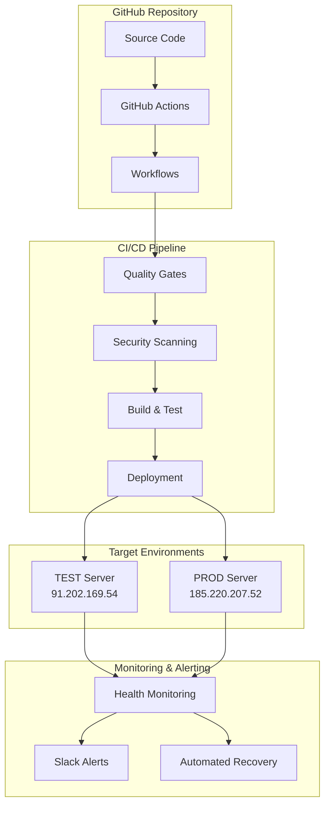
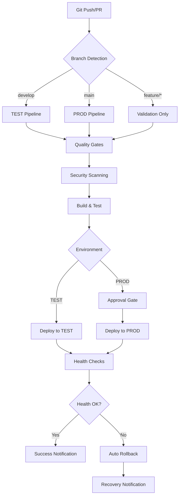
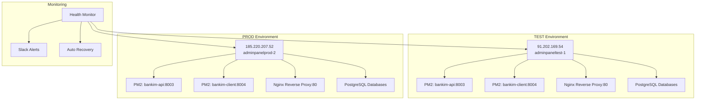
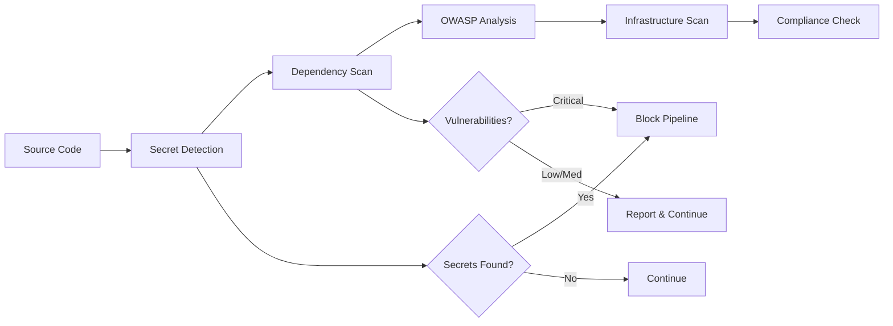
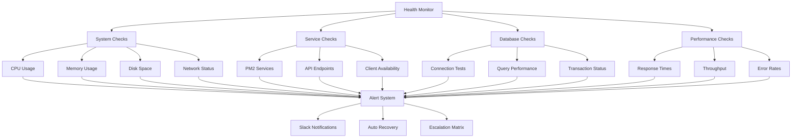
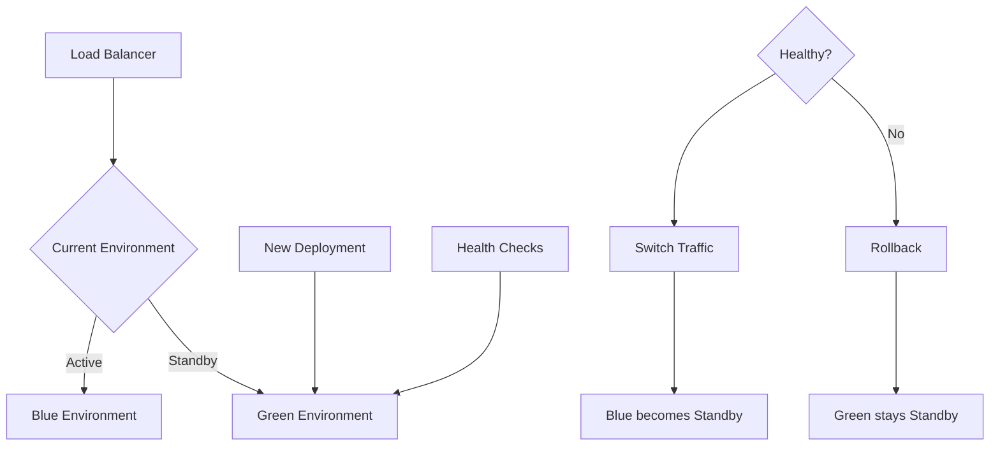

# 🏗️ BankIM CI/CD Architecture Documentation

Comprehensive technical architecture documentation for the BankIM Management Portal CI/CD pipeline.

## 📋 System Overview

The BankIM CI/CD pipeline is a production-grade, enterprise-level continuous integration and deployment system designed for high availability, security, and maintainability.

### Key Features

- **Multi-Environment Support**: Seamless deployment to TEST and PROD environments
- **Zero-Downtime Deployments**: Production deployments with no service interruption
- **Advanced Quality Gates**: Comprehensive testing, security scanning, and validation
- **Automated Rollback**: Intelligent failure detection and automatic recovery
- **Real-Time Monitoring**: Continuous health monitoring with alerting
- **Security-First Design**: Built-in security scanning and compliance checks

## 🏛️ Architecture Components

### Core Infrastructure



### Technology Stack

```yaml
Source Control:
  - GitHub (Git repository)
  - Branch Protection Rules
  - Pull Request Automation

CI/CD Platform:
  - GitHub Actions
  - Custom Workflows
  - Matrix Builds

Build System:
  - Turborepo (Monorepo Management)
  - Node.js 18.x
  - NPM Workspaces

Testing Framework:
  - Cypress (E2E Testing)
  - Jest (Unit Testing)
  - TypeScript Compiler

Security Tools:
  - NPM Audit
  - Custom Secret Scanning
  - OWASP Compliance Checks

Deployment Targets:
  - Ubuntu Linux Servers
  - PM2 Process Management
  - Nginx Reverse Proxy

Monitoring Stack:
  - Custom Health Monitor
  - PM2 Monitoring
  - System Resource Monitoring
  - Slack Integration
```

## 🔄 Pipeline Architecture

### Workflow Orchestration



### Multi-Stage Quality Gates

```yaml
Stage 1 - Code Quality:
  - TypeScript Compilation
  - ESLint Code Analysis
  - Prettier Formatting Check
  
Stage 2 - Security Scanning:
  - NPM Audit (Dependency Vulnerabilities)
  - Secret Detection Scanning
  - OWASP Security Patterns
  
Stage 3 - Testing:
  - Unit Test Execution
  - Integration Test Suite
  - End-to-End Cypress Tests
  
Stage 4 - Build Validation:
  - Multi-Package Build (Client/Server/Shared)
  - Asset Optimization
  - Bundle Size Analysis
  
Stage 5 - Deployment Readiness:
  - Environment Configuration Validation
  - Database Migration Checks
  - Infrastructure Health Verification
```

## 🌐 Environment Architecture

### Server Infrastructure



### Network Architecture

```yaml
External Access:
  - HTTP: Port 80 (Nginx)
  - HTTPS: Port 443 (Nginx + SSL)
  - SSH: Port 22 (Management)

Internal Services:
  - API Server: Port 8003
  - Client Server: Port 8004
  - PostgreSQL: Port 5432
  - Redis: Port 6379

Load Balancing:
  - Nginx Reverse Proxy
  - PM2 Cluster Mode
  - Database Connection Pooling

Security:
  - UFW Firewall
  - SSH Key Authentication
  - SSL/TLS Encryption
  - CORS Configuration
```

### Database Architecture

```yaml
Content Database:
  - Purpose: UI content, translations, CMS data
  - Schema: content_items, application_contexts
  - Access: Read/Write from API
  
Core Database:
  - Purpose: Business logic, calculations, permissions
  - Schema: user_roles, business_rules
  - Access: Read-heavy with controlled writes

Management Database:
  - Purpose: Administrative data, audit logs
  - Schema: deployment_logs, health_metrics
  - Access: System and monitoring tools

Backup Strategy:
  - Automated daily backups
  - Pre-deployment snapshots
  - 30-day retention policy
  - Compressed storage
```

## 🔐 Security Architecture

### Authentication & Authorization

```yaml
GitHub Actions:
  - SSH Key-based Authentication
  - GitHub Secrets Management
  - Environment-based Access Control
  - Branch Protection Rules

Server Access:
  - SSH Key Pairs (Ed25519)
  - Password Fallback (Encrypted)
  - Sudo Access Control
  - Audit Logging

Application Security:
  - JWT Token Authentication
  - CORS Policy Enforcement
  - Helmet.js Security Headers
  - Rate Limiting
```

### Security Scanning Pipeline



### Secret Management

```yaml
GitHub Secrets:
  - SSH_PRIVATE_KEY: Deployment authentication
  - *_SERVER_PASSWORD: Fallback authentication
  - *_DATABASE_URL: Database connections
  - SLACK_WEBHOOK_URL: Notification system

Environment Variables:
  - NODE_ENV: Environment identification
  - PORT: Service port configuration
  - *_DATABASE_URL: Runtime database access

Rotation Policy:
  - SSH Keys: Quarterly rotation
  - Database Passwords: Bi-annual rotation
  - API Keys: As required by service
```

## 📊 Monitoring Architecture

### Health Monitoring System



### Metrics Collection

```yaml
System Metrics:
  - CPU utilization (5-minute average)
  - Memory usage (RSS and heap)
  - Disk space (/ and /var partitions)
  - Network I/O statistics
  - Load average (1, 5, 15 minutes)

Application Metrics:
  - API response times (95th percentile)
  - Request throughput (requests/minute)
  - Error rates by endpoint
  - Database query performance
  - Active connections

Business Metrics:
  - Deployment frequency
  - Deployment success rate
  - Rollback frequency
  - Mean Time to Recovery (MTTR)
  - Uptime percentage (SLA: 99.9%)
```

### Alerting Framework

```yaml
Alert Severity Levels:
  - Critical: Service down, data loss risk
  - Warning: Performance degradation
  - Info: Deployment notifications
  
Alert Channels:
  - Slack: Real-time team notifications
  - Email: Executive summaries
  - GitHub Issues: Automated ticket creation
  
Alert Thresholds:
  - CPU > 80% for 5 minutes
  - Memory > 85% for 3 minutes
  - Disk space > 85%
  - API response time > 3 seconds
  - Error rate > 1%
  
Escalation Policy:
  - Level 1: Team notification (immediate)
  - Level 2: Manager notification (15 minutes)
  - Level 3: Executive notification (30 minutes)
```

## 🔄 Deployment Architecture

### Zero-Downtime Strategy

```yaml
Deployment Process:
  1. Pre-flight Checks:
     - Resource availability
     - Service health
     - Database connectivity
  
  2. Backup Creation:
     - Application state snapshot
     - Database backup
     - Configuration backup
  
  3. Staged Deployment:
     - Stop services gracefully
     - Deploy new version
     - Update configurations
  
  4. Service Restart:
     - Start services in order
     - Health check validation
     - Performance verification
  
  5. Rollback Readiness:
     - Backup verification
     - Rollback script preparation
     - Recovery procedures
```

### Blue-Green Deployment Pattern



### Rollback Architecture

```yaml
Rollback Triggers:
  - Health check failures
  - Critical error rates
  - Performance degradation
  - Manual intervention

Rollback Types:
  - Automatic: Triggered by monitoring
  - Manual: Operator initiated
  - Scheduled: Planned maintenance

Rollback Process:
  1. Traffic diversion
  2. Service shutdown
  3. Backup restoration
  4. Service restart
  5. Health validation
  6. Notification

Recovery Time Objectives:
  - Detection: < 2 minutes
  - Decision: < 1 minute
  - Execution: < 5 minutes
  - Validation: < 2 minutes
  - Total RTO: < 10 minutes
```

## 🔧 Integration Architecture

### GitHub Integration

```yaml
Webhook Events:
  - push (branches: main, develop)
  - pull_request (opened, synchronized)
  - release (published)

Branch Strategy:
  - main: Production deployments
  - develop: Test environment deployments
  - feature/*: Validation and PR testing
  - hotfix/*: Emergency production fixes

Protection Rules:
  - main: Requires PR, status checks, admin override
  - develop: Requires status checks
  - feature/*: No restrictions

Status Checks:
  - Build passing
  - Tests passing
  - Security scan clean
  - Deployment ready
```

### Third-Party Integrations

```yaml
Slack Integration:
  - Deployment notifications
  - Health alerts
  - Security warnings
  - Performance reports

Database Services:
  - PostgreSQL cluster
  - Backup services
  - Monitoring tools
  - Migration systems

External APIs:
  - Banking service integrations
  - Authentication providers
  - Logging services
  - Monitoring platforms
```

## 📈 Performance Architecture

### Optimization Strategies

```yaml
Build Optimization:
  - Turborepo caching
  - Parallel package builds
  - Incremental compilation
  - Asset optimization

Runtime Optimization:
  - PM2 cluster mode
  - Nginx load balancing
  - Database connection pooling
  - Redis caching layer

Network Optimization:
  - Gzip compression
  - CDN integration
  - HTTP/2 support
  - Connection keep-alive
```

### Scaling Architecture

```yaml
Horizontal Scaling:
  - PM2 cluster instances
  - Load balancer distribution
  - Database read replicas
  - Cache layer scaling

Vertical Scaling:
  - Server resource allocation
  - Database performance tuning
  - Memory optimization
  - CPU core utilization

Auto-Scaling Triggers:
  - CPU utilization > 70%
  - Memory usage > 80%
  - Response time > 2 seconds
  - Queue depth > 100
```

## 🔮 Future Architecture

### Planned Enhancements

```yaml
Container Migration:
  - Docker containerization
  - Kubernetes orchestration
  - Microservices architecture
  - Service mesh implementation

Advanced Monitoring:
  - Distributed tracing
  - APM integration
  - Custom metrics dashboard
  - Predictive alerting

Security Enhancements:
  - OAuth 2.0 / OIDC
  - Zero-trust networking
  - Advanced threat detection
  - Compliance automation

Performance Improvements:
  - Edge computing
  - Advanced caching
  - Database optimization
  - Real-time analytics
```

### Migration Strategy

```yaml
Phase 1 - Foundation (Q1):
  - Container preparation
  - CI/CD pipeline updates
  - Monitoring enhancement
  - Security hardening

Phase 2 - Migration (Q2):
  - Staged environment migration
  - Service decomposition
  - Data migration planning
  - Performance testing

Phase 3 - Optimization (Q3):
  - Performance tuning
  - Advanced features
  - Monitoring integration
  - Documentation updates

Phase 4 - Enhancement (Q4):
  - Advanced security
  - Scalability improvements
  - Feature additions
  - Team training
```

---

**Architecture Version:** 1.0.0  
**Last Updated:** $(date)  
**Next Review:** $(date -d '+3 months')  
**Architecture Owner:** BankIM DevOps Team

This architecture is designed to evolve with the organization's needs while maintaining high standards for security, performance, and reliability.