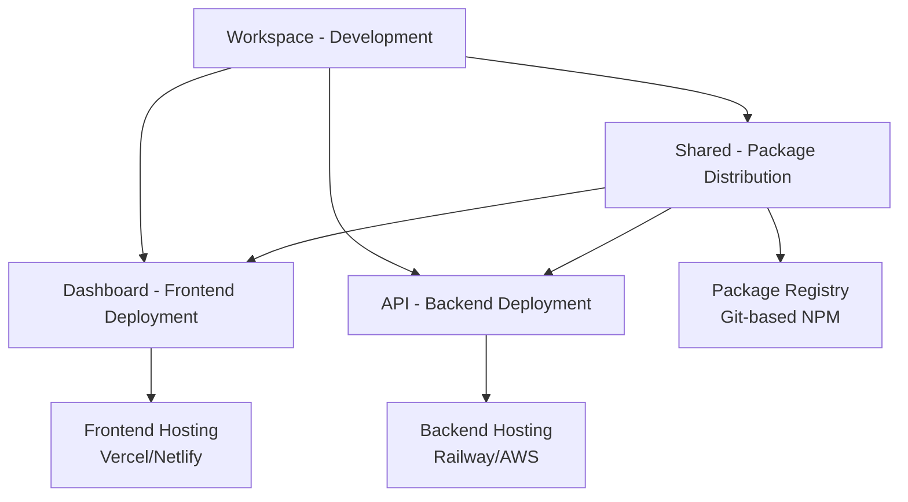

# 🏠 BankIM Admin Workspace - Development Monorepo

**Complete unified development environment for the BankIM Management Portal ecosystem**

---

## 🎯 Repository Overview

**Repository**: `bankim-admin-workspace`  
**URL**: `git@github.com:sravnenie-ipotek/bankim-admin-workspace-.git`  
**Type**: Development Workspace (Monorepo)  
**Purpose**: Unified development environment containing all packages, tools, and documentation  
**Role**: Primary development workspace - not deployed to production  

---

## 🏗️ Architecture Position

This repository serves as the **central hub** in our 4-repository hybrid architecture:

```
┌─────────────────────────────────────────────────────────────┐
│                    DEVELOPMENT LAYER                        │
│  ┌─────────────────────────────────────────────────────┐   │
│  │        🏠 bankim-admin-workspace                    │   │
│  │    (THIS REPOSITORY - Main Development Hub)        │   │
│  │                                                     │   │
│  │  📦 packages/client   📦 packages/server           │   │
│  │  📦 packages/shared   📄 docs/                     │   │
│  │  🔨 scripts/          🧪 tests/                    │   │
│  │  🛠️ tools/            ⚙️ configs/                  │   │
│  └─────────────────────────────────────────────────────┘   │
└─────────────────────────────────────────────────────────────┘
                           │
                    Automated Deploy
                           │
┌─────────────────────────────────────────────────────────────┐
│                    DEPLOYMENT LAYER                         │
│                                                             │
│  🎨 dashboard      🔧 api         📚 shared                │
│  (Frontend)        (Backend)      (Package)                │
│  Production        Production     Distribution              │
│  Hosting           Server         Registry                 │
└─────────────────────────────────────────────────────────────┘
```

---

## 📦 Repository Structure

```
bankim-admin-workspace/
├── 📁 packages/                    # Main application packages
│   ├── 🎨 client/                  # React frontend application
│   │   ├── src/                    # Source code
│   │   ├── public/                 # Static assets
│   │   ├── cypress/                # E2E tests
│   │   ├── package.json            # Development dependencies
│   │   ├── package.deploy.json     # Deployment configuration
│   │   ├── vite.config.ts          # Build configuration
│   │   └── tsconfig.json           # TypeScript configuration
│   │
│   ├── 🔧 server/                  # Node.js backend API
│   │   ├── scripts/                # Database migration scripts
│   │   ├── config/                 # Database configurations
│   │   ├── database/               # SQL schemas and migrations
│   │   ├── logs/                   # Application logs
│   │   ├── package.json            # Development dependencies
│   │   ├── package.deploy.json     # Deployment configuration
│   │   └── server.js               # Main application entry
│   │
│   └── 📚 shared/                  # Shared TypeScript types & utilities
│       ├── src/                    # TypeScript source
│       │   ├── types/              # Interface definitions
│       │   ├── utils/              # Helper functions
│       │   └── index.ts            # Main exports
│       ├── dist/                   # Compiled output
│       ├── package.json            # Package configuration
│       └── tsconfig.json           # TypeScript compilation
│
├── 📄 docs/                        # Project documentation
│   ├── REPOSITORIES_README.md      # Architecture overview (this document)
│   ├── CLAUDE.md                   # Development guide
│   ├── systemTranslationLogic.md   # Database architecture
│   └── *.md                        # Additional documentation
│
├── 🔨 scripts/                     # Automation and deployment
│   ├── push-4repos.sh              # Deploy to all 4 repositories
│   ├── push-workspace.sh           # Deploy workspace only
│   ├── push-dashboard.sh           # Deploy client only
│   ├── push-api.sh                 # Deploy server only
│   ├── push-shared.sh              # Deploy shared package only
│   └── *.sh                        # Additional automation scripts
│
├── 🧪 tests/                       # Integration testing
│   ├── *.html                      # Manual test pages
│   └── debug-*.html                # Debug utilities
│
├── 🛠️ tools/                       # Development utilities
│   ├── *.js                        # Helper scripts
│   └── *.py                        # Python utilities
│
├── ⚙️ Configuration Files
│   ├── package.json                # Workspace configuration
│   ├── turbo.json                  # Turborepo pipeline
│   ├── .gitignore                  # Git exclusions
│   └── tsconfig.json               # Global TypeScript config
│
└── 🚀 Deployment Assets
    ├── *.tar.gz                    # Backup files
    └── README.md                   # Repository overview
```

---

## 🔗 Inter-Repository Connections

### Git Remote Configuration
This workspace maintains direct connections to all deployment repositories:

```bash
# Configured remotes (automatically set up)
origin      → git@github.com:MichaelMishaev/bankimOnlineAdmin.git (legacy)
workspace   → git@github.com:sravnenie-ipotek/bankim-admin-workspace-.git (this repo)
dashboard   → git@github.com:sravnenie-ipotek/bankim-admin-dashboard.git
api         → git@github.com:sravnenie-ipotek/bankim-admin-api.git  
shared      → git@github.com:sravnenie-ipotek/bankim-admin-shared.git
```

### Content Distribution Strategy



---

## 🚀 Development Workflow

### Daily Development (Recommended)
```bash
# 1. Clone this workspace repository
git clone git@github.com:sravnenie-ipotek/bankim-admin-workspace-.git
cd bankim-admin-workspace-

# 2. Install all dependencies (handles all packages)
npm install

# 3. Start development servers (all packages)
npm run dev
# ✅ Client: http://localhost:3002
# ✅ Server: http://localhost:3001
# ✅ Shared: Auto-rebuilds on changes

# 4. Work across packages seamlessly
# - Edit client components in packages/client/src/
# - Modify server logic in packages/server/
# - Update shared types in packages/shared/src/
# - All changes hot-reload automatically
```

### Package-Specific Development
```bash
# Frontend only development
cd packages/client && npm run dev

# Backend only development  
cd packages/server && npm run dev

# Shared types development (watch mode)
cd packages/shared && npm run dev
```

### Testing & Quality Assurance
```bash
# Run all tests across packages
npm run test

# Lint all packages
npm run lint

# TypeScript type checking
npm run type-check

# Build all packages (validates everything compiles)
npm run build

# Client-specific E2E tests
npm run test:mortgage --workspace=@bankim/client
npm run test:content-errors --workspace=@bankim/client
npm run test:all --workspace=@bankim/client
```

---

## 🚀 Deployment Strategy

### Automated Multi-Repository Deployment
This workspace includes sophisticated deployment automation that pushes filtered content to each deployment repository:

```bash
# Deploy to all repositories
npm run push:all

# Selective deployment
npm run push:dashboard    # Frontend changes only
npm run push:api         # Backend changes only  
npm run push:shared      # Shared package updates only
npm run push:workspace   # Development workspace only

# Testing deployment
npm run push:dry-run     # Preview without executing
```

### Deployment Process Flow
1. **Pre-deployment Validation**:
   - Builds shared package (dependency for others)
   - Commits any uncommitted changes
   - Validates dependencies and configurations

2. **Repository-Specific Filtering**:
   - **Dashboard**: Extracts `packages/client/` + deployment config
   - **API**: Extracts `packages/server/` + deployment config  
   - **Shared**: Extracts `packages/shared/` + compiled distribution
   - **Workspace**: Pushes complete monorepo

3. **Dependency Resolution**:
   - Development: Uses local file references (`file:../shared`)
   - Deployment: Uses git references (`git+https://github.com/.../bankim-admin-shared.git`)

4. **Post-deployment Verification**:
   - Validates git operations
   - Reports deployment status
   - Provides repository URLs for verification

---

## 🛠️ Turborepo Configuration

### Pipeline Optimization
```json
{
  "pipeline": {
    "build": {
      "dependsOn": ["^build"],
      "outputs": ["dist/**", ".next/**"]
    },
    "dev": {
      "cache": false,
      "persistent": true
    },
    "test": {
      "dependsOn": ["build"],
      "outputs": ["coverage/**"]
    }
  }
}
```

### Performance Benefits
- **⚡ 60-80% faster builds** through intelligent caching
- **🔄 Parallel execution** of package tasks
- **📦 Smart dependency resolution** - builds packages in correct order
- **🎯 Incremental builds** - only rebuilds what changed
- **🚀 Hot reloading** across all packages simultaneously

---

## 📦 Package Management Strategy

### Workspace Dependencies
```json
{
  "workspaces": ["packages/*"],
  "devDependencies": {
    "turbo": "^1.11.0"
  }
}
```

### Cross-Package Dependencies
```json
// packages/client/package.json & packages/server/package.json
{
  "dependencies": {
    "@bankim/shared": "file:../shared"  // Local development
  }
}
```

### Development vs Deployment
- **Development**: Direct file references for hot reloading
- **Deployment**: Git-based references for independence
- **Versioning**: Semantic versioning with automated tagging
- **Distribution**: Zero-config - automated by deployment scripts

---

## 🎯 Strategic Advantages

### Why This Repository Architecture?

#### **🔄 Development Efficiency**
- **Single Clone**: One repository contains everything needed
- **Unified Dependencies**: Single `npm install` handles all packages
- **Hot Reloading**: Changes instantly reflect across packages
- **Shared Tooling**: Consistent linting, testing, building
- **Type Safety**: Real-time TypeScript checking across packages

#### **🚀 Deployment Flexibility**  
- **Independent Scaling**: Each deployment repository can scale independently
- **Environment Separation**: Different repositories can target different environments
- **CI/CD Freedom**: Each deployment repo can have tailored pipelines
- **Version Control**: Clean, focused history in each deployment repository

#### **👥 Team Collaboration**
- **Single Source of Truth**: All development in one place
- **Atomic Changes**: Cross-package changes in single commits
- **Consistent Environment**: All developers use identical setup
- **Simplified Onboarding**: New developers clone once and start working

---

## 🚨 Important Usage Guidelines

### ✅ **Recommended Practices**

#### Development
- **Always develop in this workspace** - never in deployment repositories
- **Use workspace commands** for package-specific operations
- **Test comprehensively** before deployment (`npm run build && npm run test`)
- **Leverage hot reloading** - changes in shared reflect everywhere instantly

#### Deployment
- **Use provided automation** - don't manually sync repositories
- **Test with dry-run first** - `npm run push:dry-run`
- **Deploy selectively** when possible - faster iteration
- **Monitor deployment status** - check provided GitHub links

### ❌ **Critical Warnings**

#### What NOT to Do
- **Don't clone deployment repositories** for development work
- **Don't modify deployment repositories directly** - all changes through workspace
- **Don't commit build artifacts** - let deployment handle builds
- **Don't manually sync repositories** - use automation scripts

#### Potential Pitfalls
- **Git remote conflicts** - use provided setup commands if remotes get misconfigured
- **Dependency mismatches** - run `npm install` in workspace root to refresh
- **Build failures** - ensure shared package builds before deploying others
- **Type inconsistencies** - keep shared types synchronized

---

## 🔧 Maintenance & Monitoring

### Repository Health Checks
```bash
# Verify all remotes configured correctly
git remote -v

# Test repository connectivity
npm run push:dry-run

# Check workspace integrity  
npm run build && npm run test && npm run lint
```

### Performance Monitoring
```bash
# Turborepo cache statistics
npx turbo run build --dry-run

# Package dependency analysis
npm ls --depth=0

# Workspace health check
npm run type-check
```

### Backup Strategy
- **Automated backups**: Created during deployment (`.tar.gz` files)
- **Git history**: Full change history in this repository
- **Deployment repos**: Independent backups in each deployment repository
- **Recovery**: Can rebuild deployment repos from this workspace anytime

---

## 📊 Technical Specifications

```yaml
Repository Type: Monorepo (Turborepo + npm workspaces)
Primary Purpose: Unified development environment
Deployment Role: Source for 3 deployment repositories
Package Count: 3 (@bankim/client, @bankim/server, @bankim/shared)

Technology Stack:
  Build System: Turborepo with intelligent caching
  Package Manager: npm workspaces (>=8.0.0)
  Runtime: Node.js (>=18.0.0)
  Languages: TypeScript, JavaScript
  Frontend: React 18 + Vite
  Backend: Express + PostgreSQL
  Testing: Cypress (E2E) + Jest (Unit)

Performance Metrics:
  Build Time: 60-80% faster with caching
  Hot Reload: <500ms cross-package updates
  Development Setup: Single command start
  Deployment: 1 command → 4 repositories
  Type Checking: Real-time across workspace
```

---

## 📞 Quick Reference

### Essential Commands
```bash
# Setup
npm install                    # Install all dependencies

# Development  
npm run dev                    # Start all packages
npm run dev --workspace=@bankim/client    # Frontend only
npm run dev --workspace=@bankim/server    # Backend only

# Quality
npm run build                  # Build all packages
npm run test                   # Run all tests
npm run lint                   # Lint all packages  
npm run type-check             # TypeScript validation

# Deployment
npm run push:all               # Deploy to all repositories
npm run push:dashboard         # Deploy frontend only
npm run push:api              # Deploy backend only
npm run push:shared           # Deploy shared package only
npm run push:dry-run          # Test deployment without executing
```

### Repository URLs
- **This Workspace**: https://github.com/sravnenie-ipotek/bankim-admin-workspace-
- **Dashboard Deploy**: https://github.com/sravnenie-ipotek/bankim-admin-dashboard
- **API Deploy**: https://github.com/sravnenie-ipotek/bankim-admin-api
- **Shared Package**: https://github.com/sravnenie-ipotek/bankim-admin-shared

---

**🎯 Bottom Line**: This workspace is your primary development environment. Clone this repository, run `npm install && npm run dev`, and you have the complete BankIM Management Portal running locally with hot reloading across all packages. When ready to deploy, use `npm run push:all` to automatically distribute to all deployment repositories.

---

_**Architecture**: Development Monorepo in 4-Repository Hybrid Strategy_  
_**Role**: Central development hub and deployment source_  
_**Status**: Production-ready development environment_